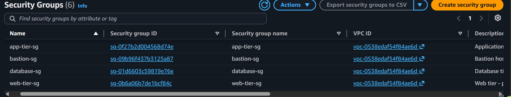
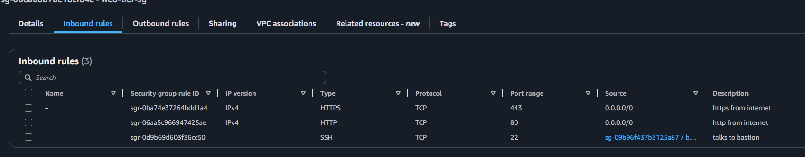

# Configure Multi-Tier Security Groups Lab - Solution

**Student Name:** [Your Name]  
**Date Completed:** [Date]

---

## Environment Details

| Tier | Instance ID | Private IP | Public IP | Security Group |
|------|-------------|------------|-----------|----------------|
| Bastion | [i-xxxxxxxxxxxxx] | [10.x.x.x] | [x.x.x.x — redact if repo is public] | [sg-bastion] |
| Web | [i-xxxxxxxxxxxxx] | [10.x.x.x] | [x.x.x.x] | [sg-web-tier] |
| App | [i-xxxxxxxxxxxxx] | [10.x.x.x] | [none] | [sg-app-tier] |
| Database | [i-xxxxxxxxxxxxx] | [10.x.x.x] | [none] | [sg-database] |

- **Region / VPC:** [eu-west-1 / vpc-xxxxxxxx]
- **Key Pair:** [bootcamp-week2-key.pem]
- **My IP (SSH source):** [x.x.x.x/32]

---

## Step 1: Create Security Groups



- [ ] `sg-bastion` created
- [ ] `sg-web-tier` created
- [ ] `sg-app-tier` created
- [ ] `sg-database` created
- [ ] Rules reference other **security groups**, not IP ranges (except port 22 on the bastion and 80/443 on the web tier)

**sg-bastion**

| Direction | Port | Source / Destination | Purpose |
|-----------|------|----------------------|---------|
| Inbound | [22] | [YOUR_IP/32] | [SSH from my laptop] |
| Outbound | [22] | [sg-web-tier, sg-app-tier, sg-database] | [Hop to private tiers] |

**sg-web-tier**

| Direction | Port | Source / Destination | Purpose |
|-----------|------|----------------------|---------|
| Inbound | [80] | [0.0.0.0/0] | [Public HTTP] |
| Inbound | [443] | [0.0.0.0/0] | [Public HTTPS] |
| Inbound | [22] | [sg-bastion] | [SSH via bastion only] |
| Outbound | [8080] | [sg-app-tier] | [Proxy to app tier] |
| Outbound | [443] | [0.0.0.0/0] | [Package downloads] |

**sg-app-tier**

| Direction | Port | Source / Destination | Purpose |
|-----------|------|----------------------|---------|
| Inbound | [8080] | [sg-web-tier] | [App traffic from web tier] |
| Inbound | [22] | [sg-bastion] | [SSH via bastion only] |
| Outbound | [3306] | [sg-database] | [MySQL queries] |
| Outbound | [443] | [0.0.0.0/0] | [Package downloads] |

**sg-database**

| Direction | Port | Source / Destination | Purpose |
|-----------|------|----------------------|---------|
| Inbound | [3306] | [sg-app-tier] | [MySQL from app tier only] |
| Inbound | [22] | [sg-bastion] | [SSH via bastion only] |
| Outbound | [443] | [0.0.0.0/0] | [Package downloads] |

**Why reference a security group instead of a private IP or CIDR?**

[Your answer]

---

## Step 2: Launch Instances and Connect Through the Bastion



- [ ] 4 instances launched, one security group each
- [ ] Connected to the bastion from my laptop
- [ ] Reached web / app / db by **private IP** through the bastion

**Which connection method did you use?** [ProxyJump / copy key to bastion]

**My `~/.ssh/config` (or the commands I ran):**
```
[Paste your host entries or ssh commands here]
```

**Why must you target the private tiers by private IP, not public IP?**

[Your answer]

---

## Step 3: Simulate Application Traffic

- [ ] Database: `nc -l 3306` loop running (`nmap-ncat` installed)
- [ ] App: `server.js` listening on 8080 (`nodejs` installed)
- [ ] Web: Nginx installed, proxying `/` to `http://APP_PRIVATE_IP:8080`, enabled on boot

**Anything that did not start cleanly?**

[Your answer, or "Nothing — all three services came up first try"]

---

## Step 4: Test Traffic Flow


**Reading results:** *connection refused* = the security group **allowed** the packet but nothing was listening. *Timeout / hang* = the security group **blocked** it.

Tick the box if the test did what the "Expected" column says.

| # | Test | Run from | Expected | Got it |
|---|------|----------|----------|--------|
| 1 | `curl http://WEB_PUBLIC_IP` | Laptop | ✅ HTTP 200 | [ ] |
| 2 | `ssh bastion`, then `ssh WEB_PRIVATE_IP` | Laptop → bastion | ✅ Connects | [ ] |
| 3 | `ssh ec2-user@WEB_PUBLIC_IP` | Laptop | ❌ Timeout | [ ] |
| 4 | `nc -zv APP_PRIVATE_IP 8080` | Web | ✅ Succeeds | [ ] |
| 5 | `nc -zv DB_PRIVATE_IP 3306` | App | ✅ Succeeds | [ ] |
| 6 | `nc -zv DB_PRIVATE_IP 3306` | Web | ❌ Timeout | [ ] |
| 7 | `curl http://WEB_PUBLIC_IP` | Laptop | ✅ "Hello from App Tier" | [ ] |

**Test 6 — how did it fail?** (Timeout is the correct answer. "Refused" means the web tier *can* reach the database and a rule is too open.)

- [ ] Timed out / hung ✅ correct
- [ ] Connection refused ⚠️ rules too permissive

**Did every test pass first try?**

- [ ] Yes
- [ ] No — what I had to fix: [one line]

---

## Step 5: Architecture


**Confirm each hop works and nothing else does:**

- [ ] Internet → Web on port **80** (allowed by `sg-web-tier`: inbound 80 from `0.0.0.0/0`)
- [ ] Web → App on port **8080** (allowed by `sg-app-tier`: inbound 8080 from `sg-web-tier`)
- [ ] App → Database on port **3306** (allowed by `sg-database`: inbound 3306 from `sg-app-tier`)
- [ ] Me → private tiers on port **22**, but only via the bastion (`sg-bastion` is the only source)
- [ ] Web → Database is **blocked** (no rule allows it)
- [ ] Internet → App / Database is **blocked** (no public route in)

**Instances with no public IP:** [app, db]

**Instances reachable from the internet:** [bastion (22 from my IP), web (80/443 from anywhere)]

---

## Bonus Challenges (Optional)

- [ ] **Challenge 1:** Remove the `443 → 0.0.0.0/0` egress rule from one tier — what broke? [Your answer]
- [ ] **Challenge 2:** Attach two security groups to one instance — how do the rules combine? [Your answer]
- [ ] **Challenge 3:** Tighten the bastion's inbound SSH to a single `/32` and re-test from a different network. [Your answer]
- [ ] **Challenge 4:** Reproduce the four groups with AWS CLI (`aws ec2 authorize-security-group-ingress`). [Your answer]

---

## Reflection

**1. Why can the app tier reach the database, but the web tier cannot?**

[Your answer]

**2. Why do all four instances only accept SSH from the bastion?**

[Your answer]

**3. When a test hung instead of failing fast, what was blocking it?**

[Your answer]

**4. Which single rule would you never write, and why?**

[Your answer]

---

## Key Learnings

**Hardest part of the lab:**
[Your answer]

**One thing I'll do differently from now on:**
[Your answer]

---

## Checklist

- [ ] 4 security groups created with SG-to-SG references
- [ ] 4 instances launched, one per tier
- [ ] SSH to private tiers works only through the bastion
- [ ] Services listening on all three tiers (nc, Node.js, Nginx)
- [ ] All 7 traffic tests run and documented
- [ ] Blocked tests confirmed as **timeout**, not refused
- [ ] End-to-end curl returns "Hello from App Tier"
- [ ] Architecture diagram included
- [ ] All screenshots captured
- [ ] Reflection questions answered
- [ ] Work committed to Git
- [ ] Pull request created

---

**Completed By:** [Your Name]  
**Date:** [Date]
